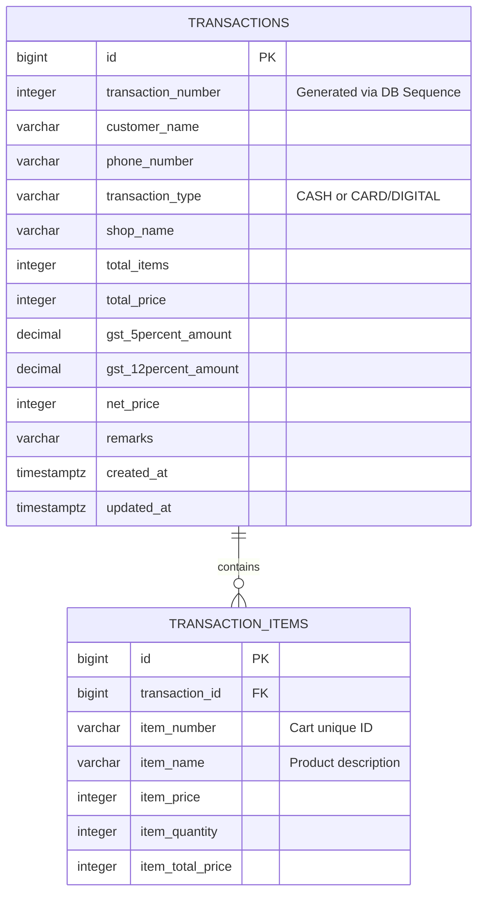
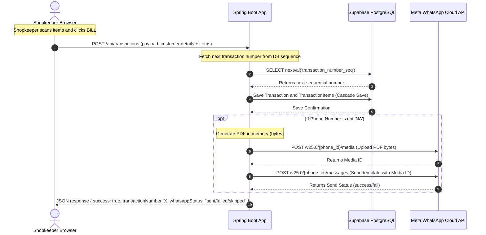

# Implementation Plan: Legacy Node.js to Java Spring Boot & PostgreSQL Modernization

## 0. Detailed Objective
The objective of this project is to migrate a legacy Node.js/Express/EJS/MongoDB billing and receipt-tracking application into a robust, type-safe Java Spring Boot 3.x web application backed by a PostgreSQL database hosted on Supabase, and deployed to Render.com.

The migration will accomplish:
* **Structural Cleanliness**: Replace messy, uncontextual route names, controller methods, and database schemas with clean, professional Spring Boot annotations and semantic Java naming conventions.
* **Data Integrity**: Eliminate local storage-based receipt numbering and move to database-level PostgreSQL sequences to guarantee unique, sequential receipt numbers.
* **Maintainability**: Port custom client-side PDFKit-based generator to standard Java PDF libraries, and Express server routes to Spring MVC `@Controller` structures.
* **Modernized Flow**: Streamline the checkout process while preserving the existing, optimized vanilla JavaScript checkout client interface and styles.

---

## 1. Contextual Renaming of Routes, Controllers, & Schemas

The legacy application contains naming structures that are confusing or redundant (e.g., calling the Daily Ledger "user profile", using a route `/users/pop/:id` to delete a transaction). We will rename these to align with standard business domain concepts.

### View Template Naming
| Legacy EJS Template | New Thymeleaf Template | Domain Meaning |
|---------------------|------------------------|----------------|
| `home.ejs`          | `checkout.html`        | The main billing and item entry POS interface |
| `user_profile.ejs`  | `ledger.html`          | The daily transaction list and sales summary |
| `month.ejs`         | `analytics.html`       | The 30-day analytics bar chart |
| `layout.ejs`        | `layout.html`          | The master layout wrapper |

### API & Web Routes Naming
| HTTP Method | Legacy Route | New Controller Endpoint | Controller Class | Purpose |
|-------------|--------------|-------------------------|------------------|---------|
| `GET`       | `/`          | `/`                     | `CheckoutController` | Renders the POS checkout view |
| `POST`      | `/transaction/create` | `/api/transactions` | `TransactionRestController` | Saves transaction and sends WhatsApp invoice |
| `GET`       | `/users/profile` | `/ledger`           | `LedgerController` | Renders today's sales ledger |
| `GET`       | `/users/profile/:date` | `/ledger/{date}` | `LedgerController` | Renders sales ledger for a specific date |
| `GET`       | `/users/month` | `/analytics`          | `AnalyticsController` | Renders the monthly sales dashboard |
| `POST`/`GET`| `/users/pop/:id` | `POST /ledger/delete/{id}` | `LedgerController` | Deletes a transaction |

---

## 2. Legacy Data Modeling Critique & Propose New Model

### Critique of Legacy MongoDB Design
1. **Fragile Transaction Numbering**: The receipt number (`transactionNumber`) was generated client-side by fetching a counter from browser `localStorage` and posting it to the backend. If the browser cache was cleared, the counter reset, causing duplicate receipt numbers in the DB.
2. **Redundant Fields**:
   * `transactionName` was hardcoded to `customerName || "TBD"`.
   * `remarks` was hardcoded to store the `customerName`.
   * `shopname` was hardcoded to `"Perfect Collection"`.
3. **Embedded Array Caching**: Store items (`purchases`) were stored as an embedded array of sub-documents inside the transaction document. In a relational database, this is bad normalized form.
4. **Hardcoded GST Fields**: `gstAsPerfive` and `gstAsPertwel` represent the calculated tax portions. In the client JS, `gstAsPertwel` is currently hardcoded to `0`, but both fields are written to the database.

### Proposed PostgreSQL Data Model

We will implement a clean, normalized relational model with a cascading `1:N` mapping between the parent Transaction and its child items.



### Key DB Enhancements
* **`transaction_number`**: Driven by a PostgreSQL sequence `transaction_number_seq` that automatically increments on insert:
  ```sql
  CREATE SEQUENCE transaction_number_seq START WITH 1;
  ```
* **Normalization**: Purchases are split into a separate `transaction_items` table with foreign key constraint mapping back to `transactions` (`ON DELETE CASCADE`).

---

## 3. Deployed Application Flow

The new Spring Boot architecture handles sequential requests, PDF creation, and Meta API requests as follows:



---

## 4. Concrete JPQL Queries

In Node.js, Mongoose aggregation pipelines (`$match`, `$group`, `$dateToString`) were used to generate sales analytics. In Spring Boot, we will use Spring Data JPA `@Query` annotations containing optimized JPQL (Java Persistence Query Language) or Native SQL to retrieve these.

### Query 1: Fetch Transactions for a Specific Date
To get transactions for a given day (midnight to 23:59:59), we use a range query:
```java
@Query("SELECT t FROM Transaction t WHERE t.createdAt >= :startDate AND t.createdAt <= :endDate ORDER BY t.transactionNumber DESC")
List<Transaction> findTransactionsByDate(
    @Param("startDate") ZonedDateTime startDate, 
    @Param("endDate") ZonedDateTime endDate
);
```

### Query 2: Daily Sales & GST Aggregation (Ledger Totals)
To calculate Today's Sales and Tax totals for the header cards:
```java
@Query("SELECT new com.perfectcollection.invoicedb.dto.SalesSummary(" +
       "COALESCE(SUM(t.netPrice), 0), " +
       "COALESCE(SUM(t.gst5PercentAmount), 0), " +
       "COALESCE(SUM(t.gst12PercentAmount), 0)) " +
       "FROM Transaction t WHERE t.createdAt >= :startDate AND t.createdAt <= :endDate")
SalesSummary getSalesSummaryForDate(
    @Param("startDate") ZonedDateTime startDate, 
    @Param("endDate") ZonedDateTime endDate
);
```

### Query 3: 30-Day Daily Analytics Grouping
To feed Chart.js on the analytics page with daily sales figures for the past 30 days:
```java
@Query("SELECT new com.perfectcollection.invoicedb.dto.DailyAnalytics(" +
       "CAST(t.createdAt AS date), SUM(t.netPrice)) " +
       "FROM Transaction t " +
       "WHERE t.createdAt >= :thirtyDaysAgo " +
       "GROUP BY CAST(t.createdAt AS date) " +
       "ORDER BY CAST(t.createdAt AS date) ASC")
List<DailyAnalytics> getMonthlyAnalytics(
    @Param("thirtyDaysAgo") ZonedDateTime thirtyDaysAgo
);
```

---

## 5. Architectural Alignment (User Choices Embedded)

* **Authentication**: **None** (per your instructions, Spring Security will not be integrated at this stage).
* **Transaction Numbers**: **Server-Generated**. The receipt counter will be managed entirely by a database-side sequence, preventing duplicate number generation.
* **Supabase Project**: Active. A new PostgreSQL instance named `perfect-collection-db` is configured on Supabase (ap-south-1).
* **Environment**: Java **25.0.1** on macOS, target compiled for Java **21** compatibility.
* **Migration Strategy**: Start fresh. No MongoDB migration script is required; all legacy databases will be decoupled and we will start with a clean schema.
* **Project Structure**: Created as a subproject inside the `/invoice-db` folder of the current workspace root.

---

## 6. Verification Plan

### Automated Verification
* Run `./gradlew test` to execute unit tests for:
  - Sequential ID generation.
  - Cascading database persistence.
  - Date aggregation JPQL queries.
* Validate PDF generation schema outputs using mock transaction items.

### Manual Verification
1. Open the checkout page at `http://localhost:8080/`.
2. Save an empty transaction $\rightarrow$ verify UI validations trigger.
3. Save a transaction with valid details $\rightarrow$ verify it is logged in Supabase with an incremented sequence number.
4. Open `/ledger` $\rightarrow$ verify totals match the database sum.
5. Open `/analytics` $\rightarrow$ verify Chart.js renders the sales data.
